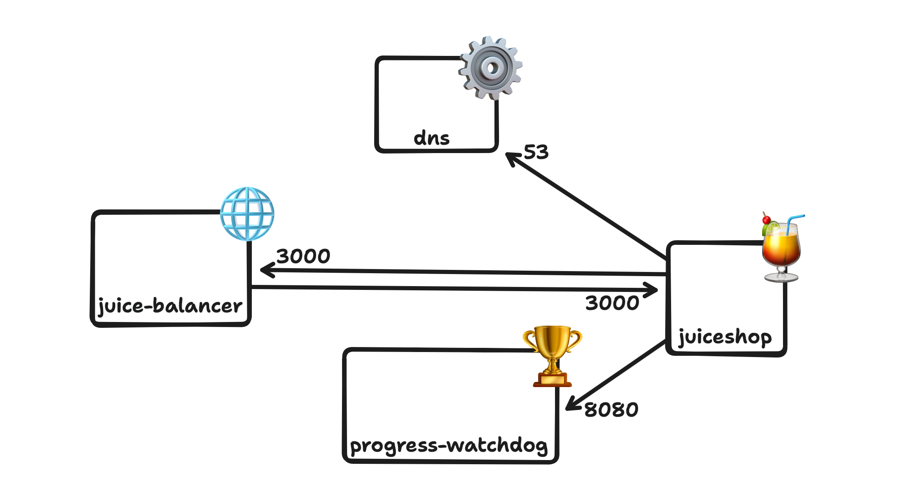

MultiJuicer er et verktøy for å provisjonere og hoste CTF ved bruk av OWASP JuiceShop sin sårbare opplærings portal for pentesting og applikasjonssikkerhet.



---

🎯 SCOREBOARD: [https://ctf.local/balancer/score-board/](https://ctf.local/balancer/score-board/)

🌐 URL: [https://ctf.local](https://ctf.local)

📦 github: [https://github.com/juice-shop/multi-juicer](https://github.com/juice-shop/multi-juicer)

---

## Admin Passord
Admin passord hentes ut ved:

```bash
kubectl get secrets juice-balancer-secret -o=jsonpath='{.data.adminPassword}' -n juiceshop | base64 --decode && echo
```

## NetworkPolicy
Det er lagt på en egen NetworkPolicy rundt JuiceShop, for å sikre at den kun kan kommunisere med de tjenestene den har behov for å kommunisere med. Default regel er deny på inngående og utgående.


