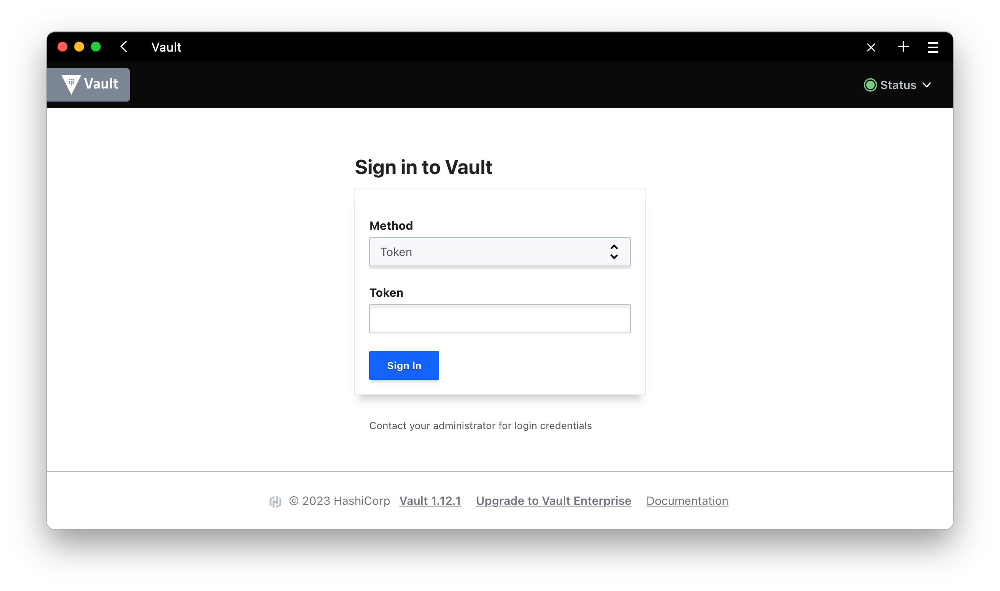

HashiCorp Vault er en verktøykasse med sikkerhetsverktøy med blant annet muligheter for å håndtere passord, hemmeligheter, autentisere, autorisere, kryptere, signere osv.

Vi skal bruke Vault til å signere våre images.

## Installasjon

### Initialize

Etter installasjon så må vi initalisere vault med å definere antall nøkler, og hvor mange av de som må brukes for å låse opp velvet. Disse nøklene blir lagret på egen maskin.

```shell
kubectl -n vault exec -it vault-0 -- vault operator init -key-shares=5 -key-threshold=2 --format json > vault-secrets.json
```

### Unseal

Når velvet er initialisert, så må vi låse det opp. Disse tre linjene låser det opp for oss ved å velge nøkkel nr 0,2 og 4.

```shell
kubectl exec -n vault -it vault-0 -- vault operator unseal $( jq -r '.unseal_keys_b64[0]' vault-secrets.json)
kubectl exec -n vault -it vault-0 -- vault operator unseal $( jq -r '.unseal_keys_b64[2]' vault-secrets.json)
kubectl exec -n vault -it vault-0 -- vault operator unseal $( jq -r '.unseal_keys_b64[4]' vault-secrets.json)
```

## Etter installasjon

Etter init og unseal av Vault kan man fortsette om det er ønskelig å signere med Vault eller å bruke Vault til andre tjenester.

### Environment variables

Dette er variabler som brukes for å aksessere og interagere med vault.

```shell
export VAULT_TOKEN="$(jq -r .root_token ./vault-secrets.json)"
export VAULT_ADDR=https://vault.local #Kun nødvendig om man bruker vault-cli eller cosign for signering ved bruk av Vault.
```

### Tilgang

Vault er nå låst opp og tilgjengelig på [https://vault.local](https://vault.local), bruk verdien `root_token` fra `vault-secrets.json` for å logge inn. Root token skal kun benyttes for å starte opp vaultet, før det bør slettes. Ut fra unseal-tokens så generer man et nytt root token ved behov. Men aller helst så bør man bruke annen type innlogging.



For å lage nytt root_token fra `unseal_tokens`, [les her](https://developer.hashicorp.com/vault/tutorials/operations/generate-root#generate-root)



### Transit Engine og signering

For å signere ved bruk av Vault må vi skru på Transit engine, dette gjøres ved å kjøre følgende kommando:

```shell
kubectl exec -n vault -it vault-0 -- sh -c "VAULT_TOKEN=$VAULT_TOKEN vault secrets enable transit"
```

### Smarte kommandoer

Alias for å imitere vault lokalt installert

```shell
alias vault="kubectl exec -n vault -it vault-0 -- sh -c \"VAULT_TOKEN=$VAULT_TOKEN vault status\""
alias vault="kubectl exec -it vault-0 -n vault -- env VAULT_TOKEN=$VAULT_TOKEN vault"
```
