Gitea er et verktøy for å hoste sine egne git repositories.

DroneCI er et byggelinje verktøy for å bygge applikasjoner etter definisjoner.

Disse to spiller på lag, slik at hver commit til Gitea starter et bygg i DroneCI.

Når du nå åpner ArgoCD i nettleseren vil du se en app som heter `cluster` og som er ute av sync. Hvis du så trykker på synkroniser vil du se at den oppretter en Gitea, Drone server og Drone runner instans for oss.


```bash
brukernavn: gitea
passord: gitops
```

## Importer (fork) GitHub repoet

```shell
https://github.com/NorskHelsenett/gitOps.git
```

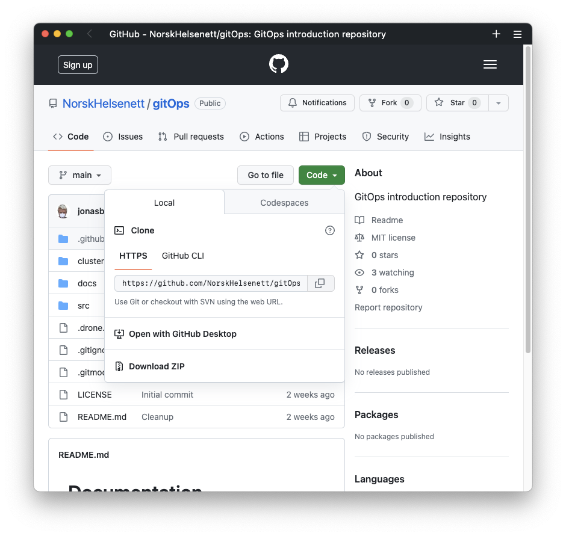

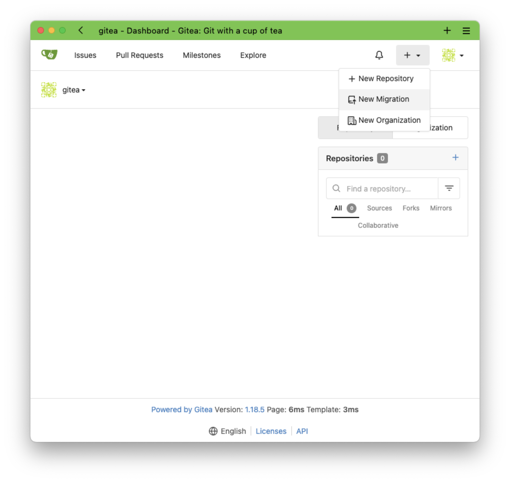

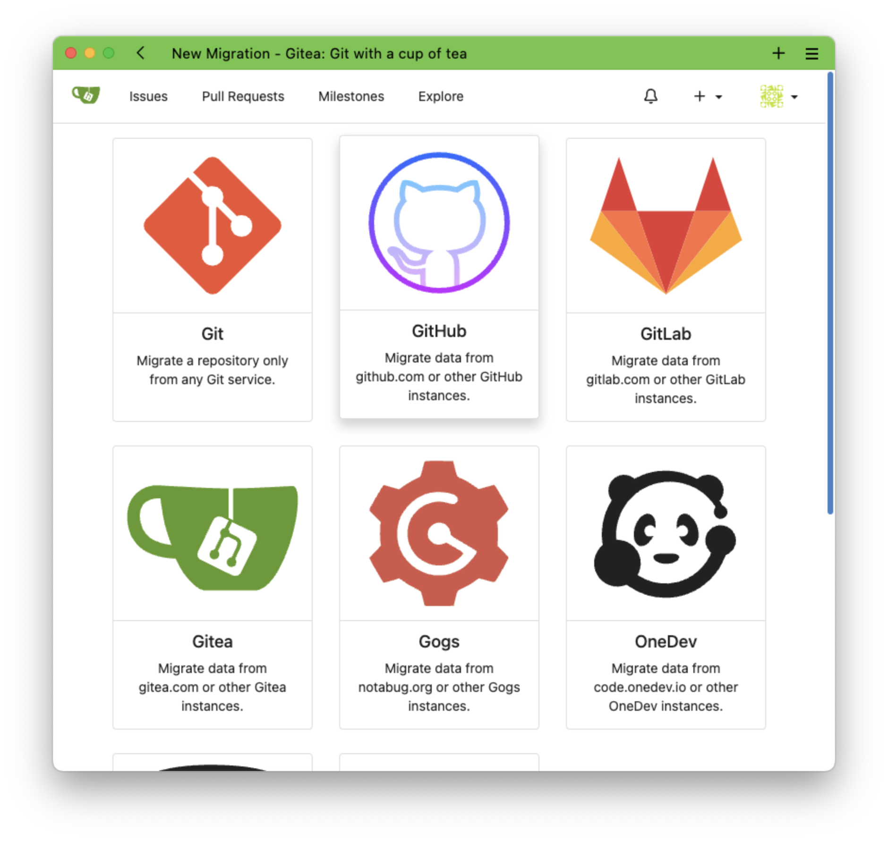

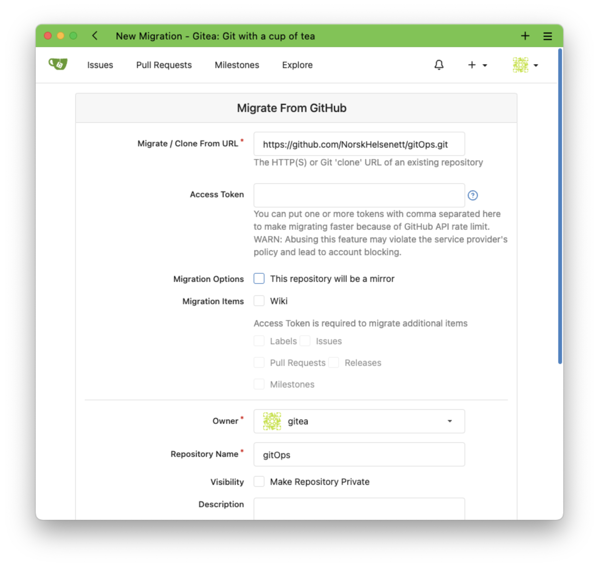

## OAuth2 i Gitea

Lag en OAuth2 applikasjon med følgende innstillinger:
```bash
Application Name: DroneCI
Callback URI: https://drone.local/login
```

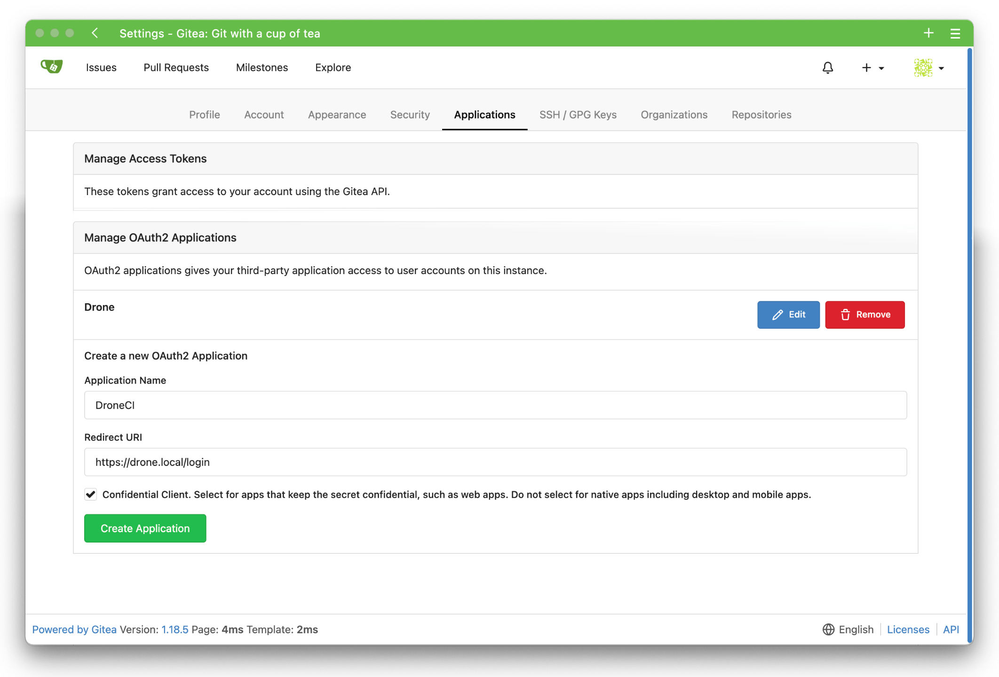


Kopier `Client ID` og `Client Secret` og commit de til `cluster/project/drone/drone-secrets.yml`.
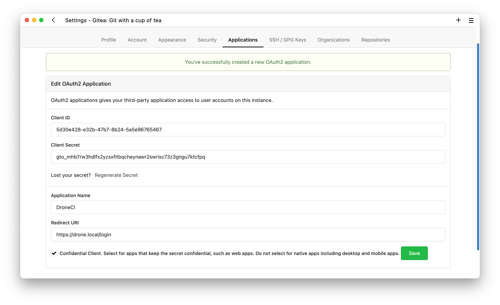

Lagre disse verdiene fra Gitea til `cluster/project/drone/drone-secrets.yml` ved en commit.
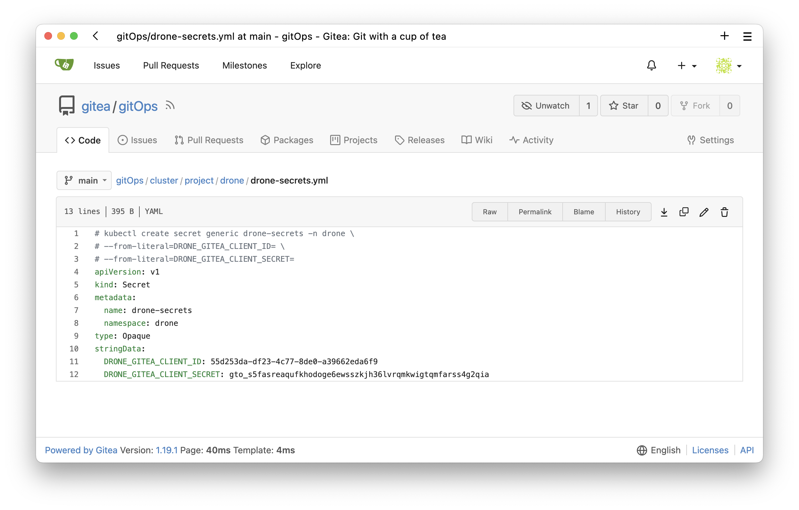

Trykk på **REFRESH** i ArgoCD og hemmeligheten vil automatisk oppdateres
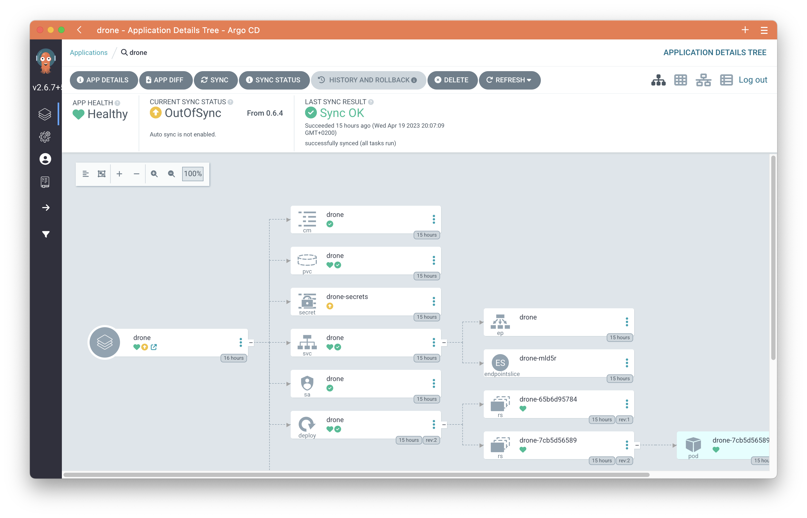

**RESTART** DroneCI Deploymentet etter at hemmeligheten er synkroniser, for at DroneCI skal ta det i bruk.
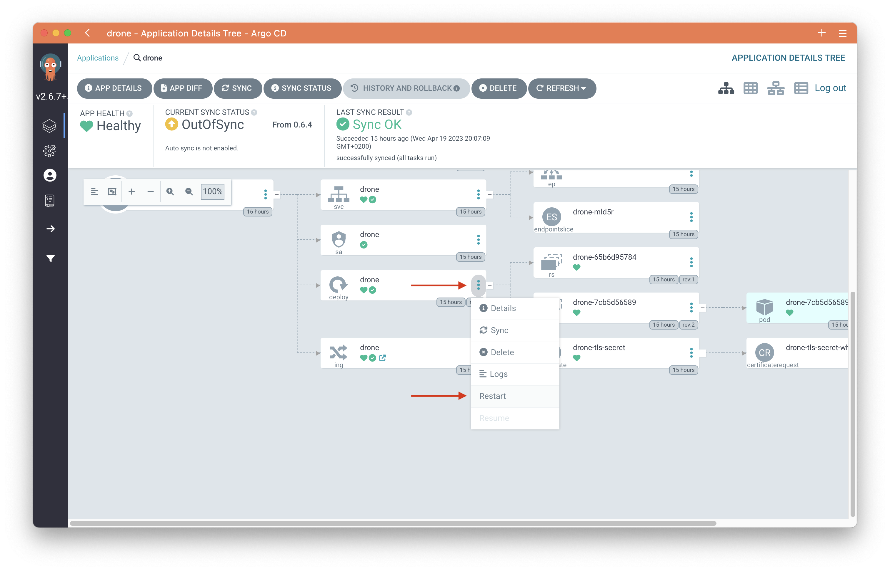

## DroneCI
### Installasjon
Gå til [Drone.local](https://drone.local) for å logge inn.

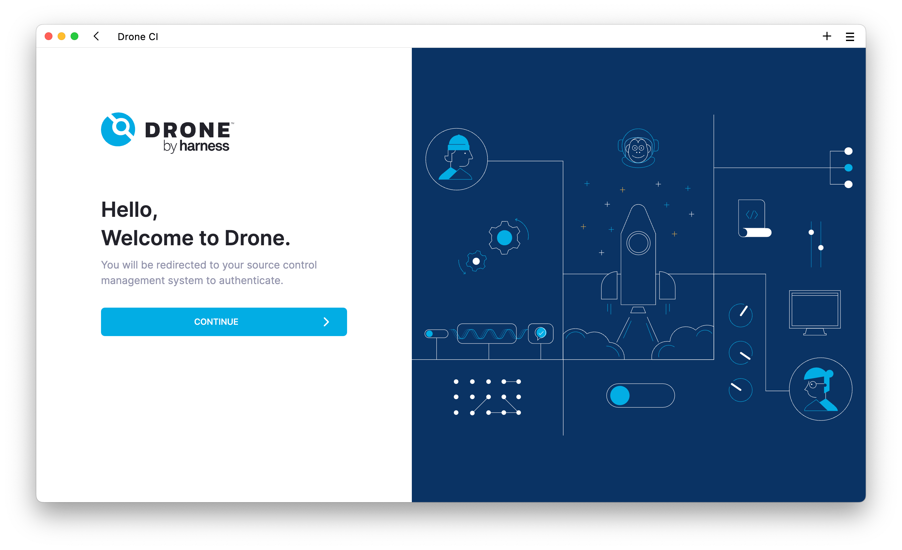

Du vil nå bli sendt til Gitea for autentisering før du kommer tilbake til DroneCI for registrering. `gitea` brukeren er allerede registert som admin i DroneCI fra JWT token til Gitea, så her kan du skrive hva som helst i feltene

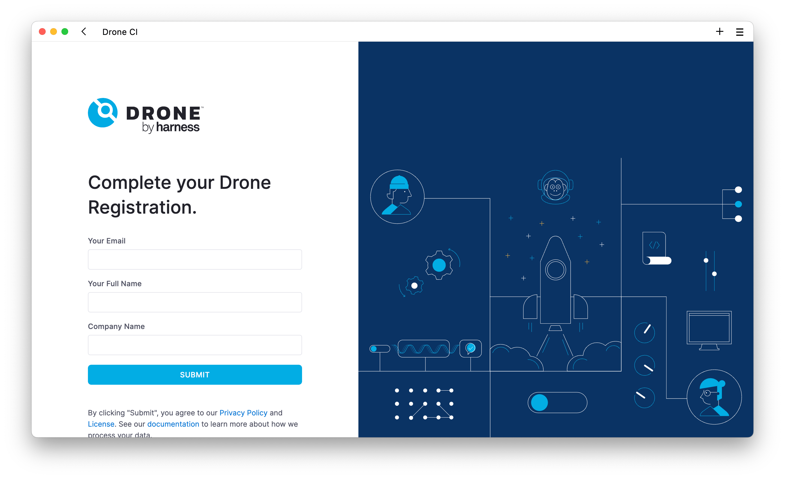

Når du nå synkroniserer prosjektet vil ArgoCD installere DroneCI server og runner.

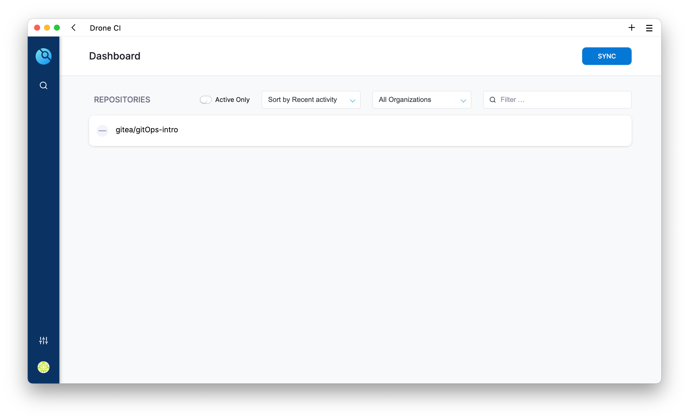

*Hvis det fortsatt er tomt, sørg for at `Active Only` ikke skrudd på*.

### Hemmeligheter
Aktiver repoet, og legg inn i disse to hemmelighetene

`Settings > Organization (Secrets)`

Variabel | Verdi
---|--:
registry_username | gitea
registry_password | gitops

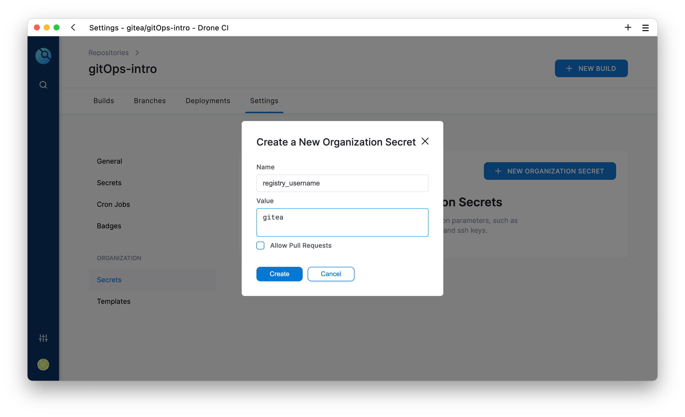

Nå er det klart for å starte et nytt bygg.

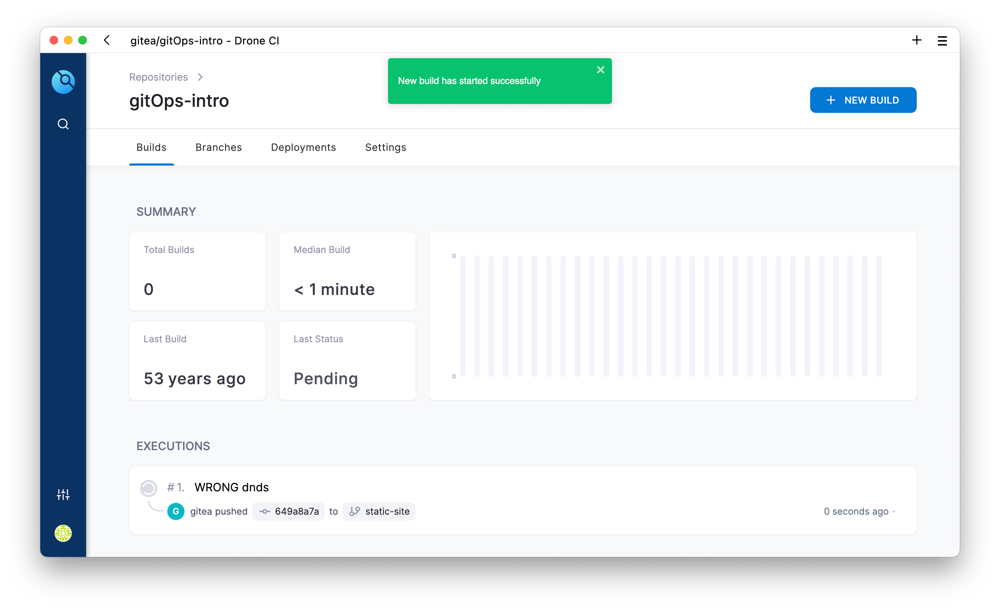


