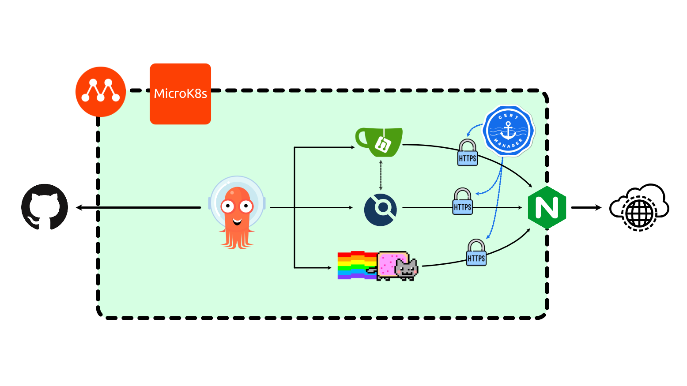

Dette er en ressursside for hvordan komme i gang med gitOps, enten du skal ta i bruk noe profesjonelt eller bare sette opp noe enkelt hjemme.

gitOps er en pull metodikk, der en operator som installert i hvert miljø vil gå mot et git repo for å lytte på endringer. gitOps operatoren vil alltid sørge for at kjøretidsmiljøet er i henhold til spesifikasjonen som ligger på git. Endres git, vil operatoren gjenspeile det i klusteret. Kjent som en leveranse. Hvis noen endrer på ressursene i klusteret, vil gitOps reversere det slik at det igjen er likt det som er definert.

Siden gitOps jobber etter pull metodikken, vil det si at det er klusteret som har tilgang på de nødvendige hemmelighetene for å få tilgang til git eller image repo som dockerhub. Dermed kan klusteret være helt hermetisert og isolert, noe som er sikrere enn en tradisjonell push metodikk der en byggelinje f.eks pusher artifaktene til miljøene. I de tilfellene må byggelinjen har de nødvendige tilgangene for å kunne kontakte miljøene.

## Oppsett
I dette oppsett inngår følgende portefølje av produkter:

Produkt | URL | Beskrivelse
---:|---|---
ArgoCD | [ArgoCD](https://argo-cd.readthedocs.io/en/stable/) | gitOps operatoren vår, som vil lytte på et git repo og gjøre endringer mot klusteret
Gitea | [Gitea](https://gitea.io/en-us/) | on-prem github alternativ
DroneCI | [DroneCI](https://www.drone.io) | bygg agenter for bygging av artifakter og produkter
Nyan | [NyanCat](https://github.com/cristurm/nyan-cat) | nyancat - brukes for å teste ingress, sertifikater og byggelinje
Cert-Manager | [Cert-Manager](https://cert-manager.io) | brukes for å utstede selv signerte sertifikater
NGINX | [NGINX](https://www.nginx.com) | ingress kontrolleren vår, på en måte en reverse-proxy
Multipass |[ Multipass](http://multipass.run) | brukes for å opprette en lokal VM, på mange måter veldig likt WSL2
microk8s |[ microk8s](http://microk8s.io) | et produkt for å provisjonere et kubernetes kluster. Et av mange gode alternativer

## TIPS

#### 1. Egne kildekode repoer
Hold kildekode og manifest repoer adskilt.

Ved å ha et eget repo for kildekode, og et eget repo for manifester øker man sikkerheten og kvaliteten på organiseringen. Det blir fort mye støy ved å ha en automatisk CI som pusher til et manifest repo i tillegg til at utviklere jobber i samme repo.

Sikkerhet. Ved å to forskjellige repoer kan man granulere aksessen til manifest repoet, kanskje det er egne DevOps utviklere som kun skal ha mulighet til å gjøre endringer der?

#### 2. ArgoCD GUI

ArgoCD er en deklerativ operator, alle endringer som gjøres i GUI gjenspeiles til komponenter i kubernetess om `ConfigMap` eller `Secrets`. Ved en endring i UI vil ArgoCD endre på en `ConfigMap` f.eks, og så vil en annen komponent lytte på denne `ConfigMap` og gjøre endringer i klusteret.
Det er lett å gjøre endringer i ArgoCD GUI der alle parametere er tilgjengelig, for så å hente ut disse endringene og pushe de til et git repo.

#### 3. Bruk DIGEST, aldri tags

Tags er en ikke immutabel verdi, som betyr at den kan overskrives på en enkel måte. Det betyr at man aldri helt vet hvilken versjon av et image som bruker.

Ved å bruke `digest` oppnår man også en annen bi-effekt, integritet. Når man bruker `digest` vil både Docker og Kubernetes verifisere denne digesten når de laster ned et image. Hvis det ikke er samsvar i `digest` og image fra registeret, vil de nekte å kjøre opp dette.

#### 4. LINTING

Bruk LINTING av dockerfiler, som f.eks [Hadolint](https://github.com/hadolint/hadolint).

Da vil man få gode tilbakemeldinger ved redigering i Dockerfile slik at man lærer seg å lagre sikre gode images.

#### 5. Sårbarhetsskanning

Bruk løsninger som [Trivvy](https://github.com/aquasecurity/trivy) og [PopEye](https://popeyecli.io/) for å finne sårbarheter i et kluster og images.

#### 6. Ikke ha automatisk deploy mellom major versjoner

Major HELM versjoner kan bryte en deployment, vær derfor nøye med å pinne til en nøyaktig versjon som f.eks `1.0.1` eller `1.x` i ArgoCD.

#### 7. Ikke kjør som `root`

Det å kjøre som `root` har historisk sett vært standarden, selv om det nå ser ut til å endre seg.

Prøv der det er mulig å kjøre som en ikke-priviligert bruker som ikke har unødvendige ressurstilganger.

#### 8. Isolering

Sørg for at en POD, CONTAINER, NAMESPACE etc. er isolert og kun inneholder de komponenter som er nødvendig for å kjøre én tjeneste. Ikke bland flere tjenester under en pod eller deployement.
