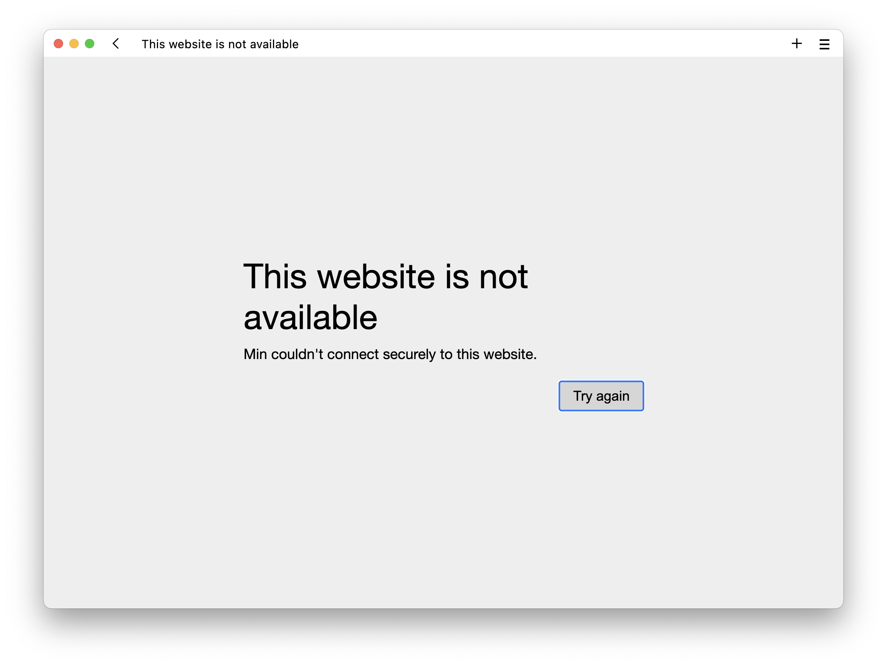

**Sørg for følgende:**
- Du har klonet repoet inn til git.local fra github
- DroneCI har synkronisert repoet fra git.local
- Hemmelighetene `registry_username` og `registry_password` er lagt til i DroneCI
- DroneCI har bygd nyancat

Målet er å få https://nyan.local opp og kjøre. Hvis du prøver å gå til denne siden nå, vil du få en `This website is not available`.



Gå tilbake til ArgoCD og synkroniser applikasjonen,




```shell
microk8s ctr images pull git.local/gitea/nyancat:latest
```
