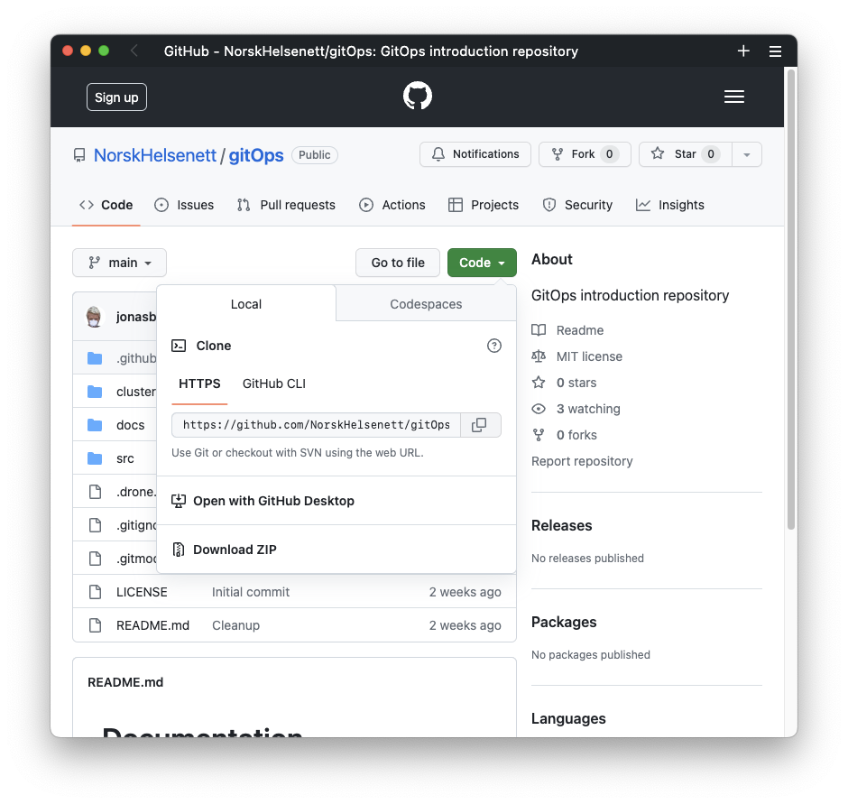
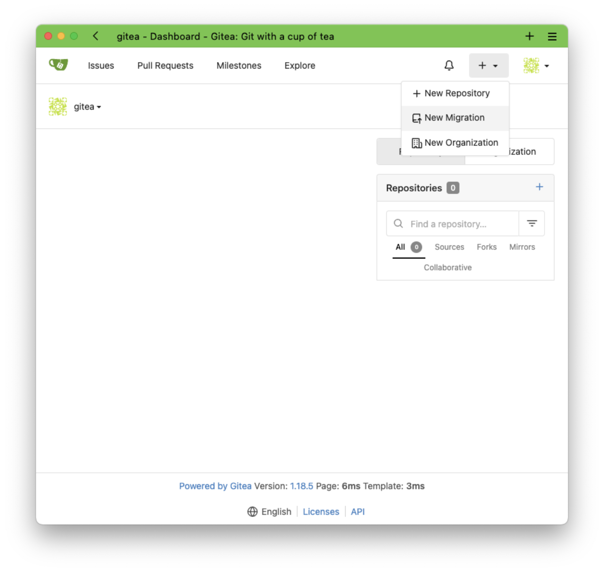
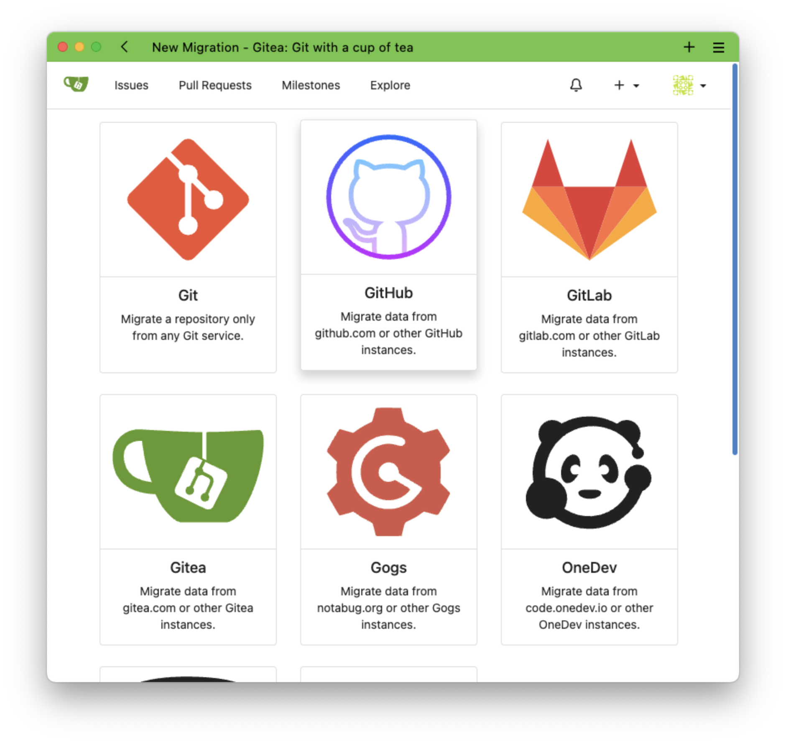
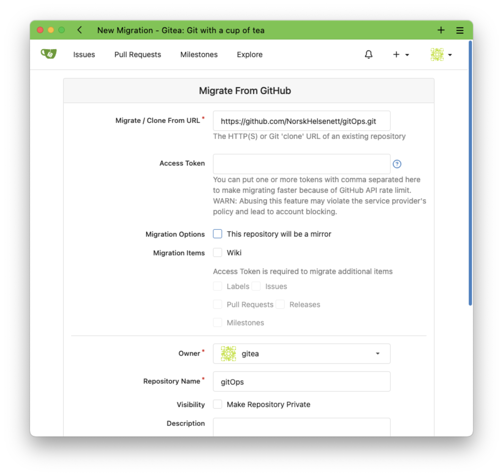
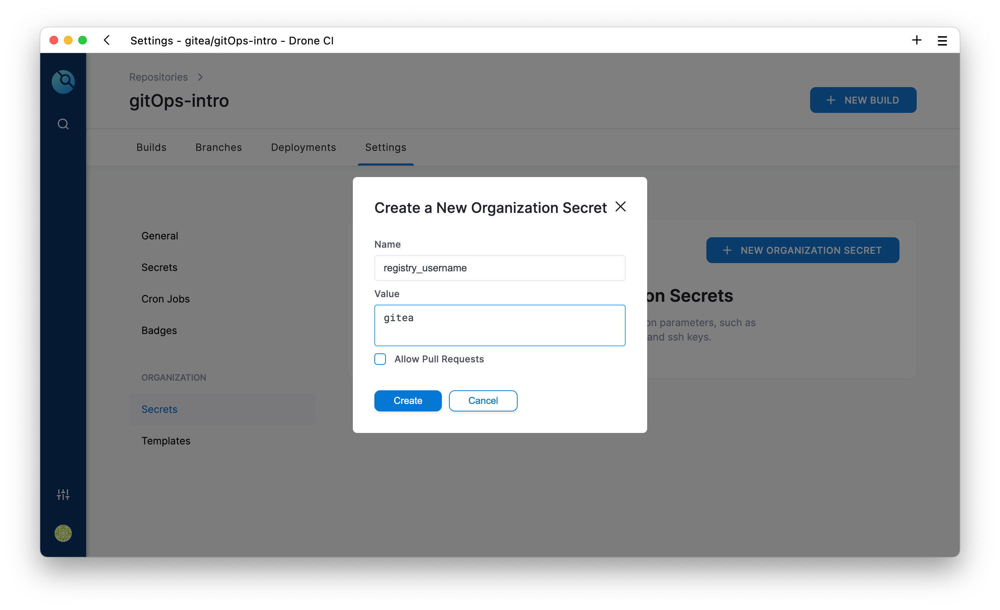

Gitea er et verktøy for å hoste sine egne git repositories.

DroneCI er et byggelinje verktøy for å bygge applikasjoner etter definisjoner.

Disse to spiller på lag, slik at hver commit til Gitea starter et bygg i DroneCI.

Når du nå åpner ArgoCD i nettleseren vil du se en app som heter `cluster` og som er ute av sync. Hvis du så trykker på synkroniser vil du se at den oppretter en Gitea, Drone server og Drone runner instans for oss.


```bash
brukernavn: gitea
passord: gitops
```

## Importer (fork) GitHub repoet









### Lag OAuth2 applikasjon i Gitea


Lag en OAuth2 applikasjon med følgende innstillinger:
```bash
Application Name: DroneCI
Callback URI: https://drone.local/login
```

Kopier `Client ID` og `Client Secret` og bruk de som override i ArgoCD for DroneCI etter installasjon i steget under.


# DroneCI

## Overskriv parametere
Gå til [Drone.local](https://drone.local) for å logge inn.


Du vil nå bli sendt til Gitea for autentisering før du kommer tilbake til DroneCI for registrering. `gitea` brukeren er allerede registert som admin i DroneCI fra JWT token til Gitea, så her kan du skrive hva som helst i feltene


Når du nå synkroniserer prosjektet vil ArgoCD installere DroneCI server og runner.


*Hvis det fortsatt er tomt, sørg for at `Active Only` ikke skrudd på*.

Aktiver repoet, og legg inn i disse to hemmelighetene:

Variabel | Verdi
---|--:
registry_username | gitea
registry_password | gitops



Nå er det klart for å starte et nytt bygg.

