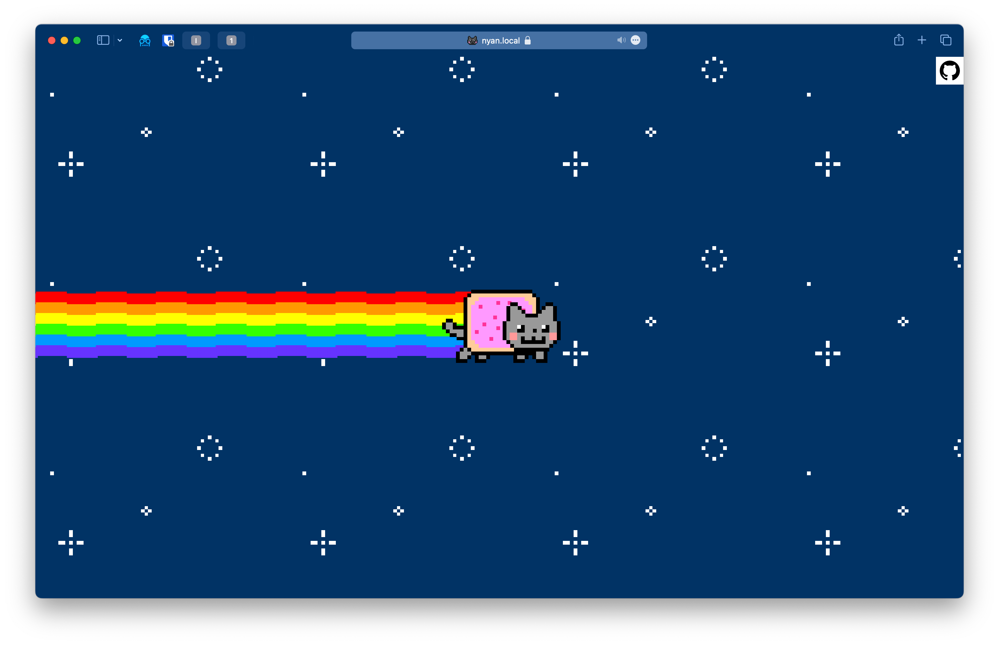
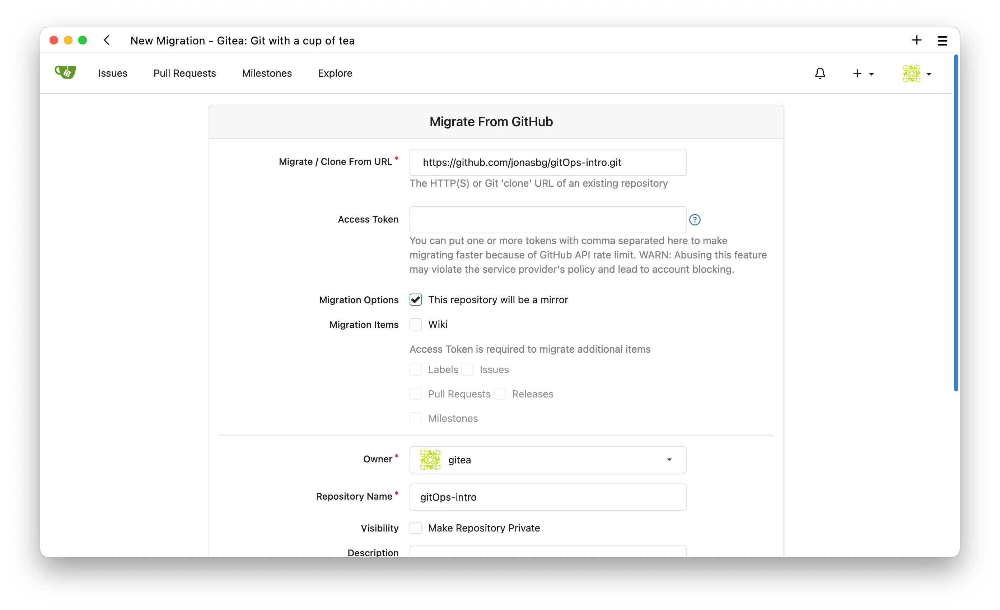
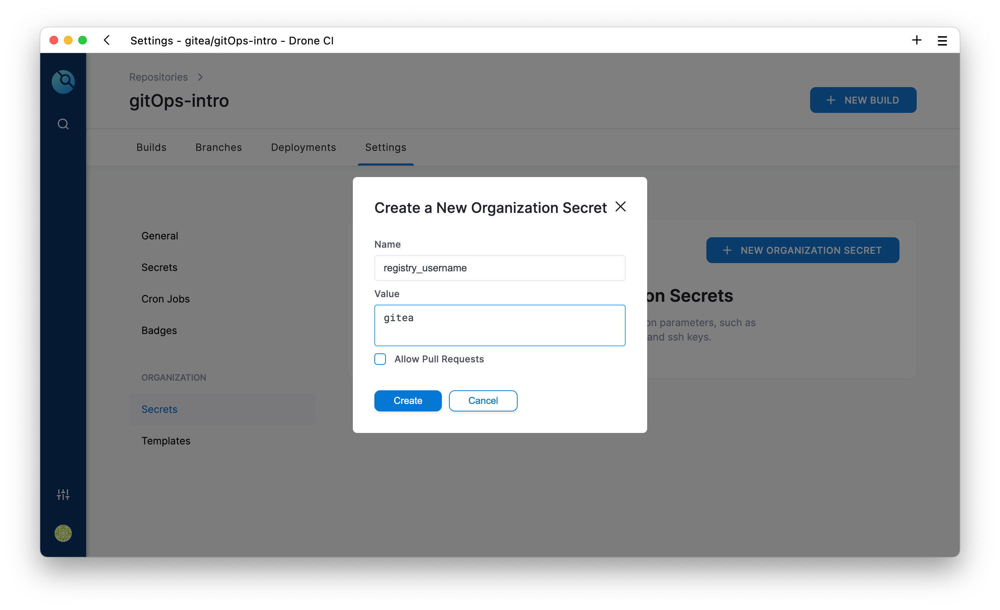
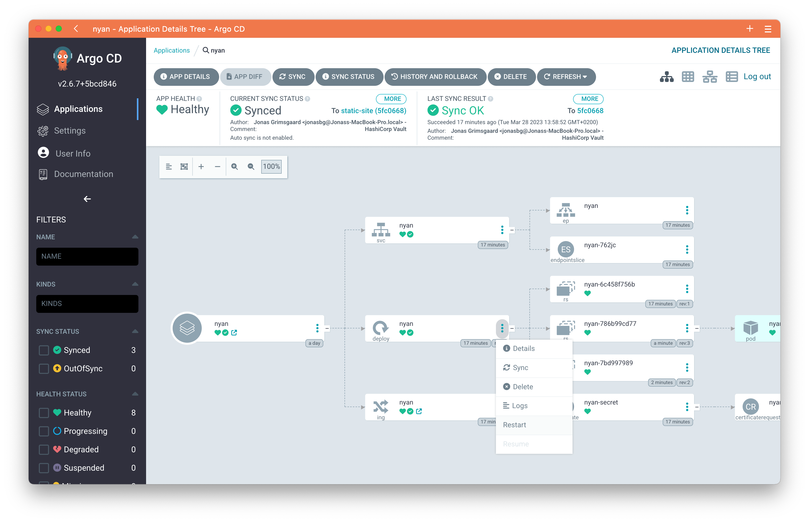
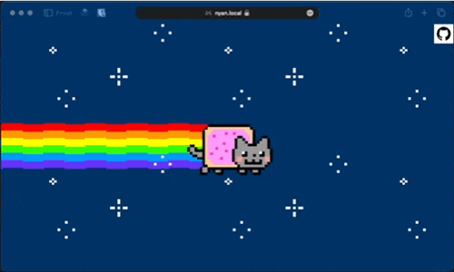

Målet er å få https://nyan.local opp og kjøre. Hvis du prøver å gå til denne siden nå, vil du få en `503 Service Temporarily Unavailable`.

Dette fungerer ikke fordi i manifestet sier vi at image skal hentes fra [git.local/gitea/nyancat](git.local/gitea/nyancat), men dette image er ikke laget enda. Derfor må vi importere github repoet inn i gitea, og så kjøre et DroneCI bygg.

## 1. Migrer fra Github
Gå til https://git.local og vel `New Migration`, velg GitHub og migrer fra `
https://github.com/jonasbg/gitOps-intro.git`
  - avhuk `This repository will be a mirror` om du ønsker kontinuerlige oppdateringer synkronisert fra github og til gitea.

## 2. Klargjør DroneCI

Logg inn i https://drone.local og synkroniser. Hvis det er tomt, trykk på [Sync] øverst til høyre.

*Hvis det fortsatt er tomt, sørg for at `Active Only` ikke skrudd på*.

Aktiver repoet, og legg inn i disse to hemmelighetene:

Variabel | Verdi
---|--:
registry_username | gitea
registry_password | gitops

## 3. Bygg image
Initialiser et nytt bygg, ikke bekymre deg om siste steget blir rødt.

## 4. ArgoCd

Gå tilbake til ArgoCD og restart deploymentet,

# SUKSESS

